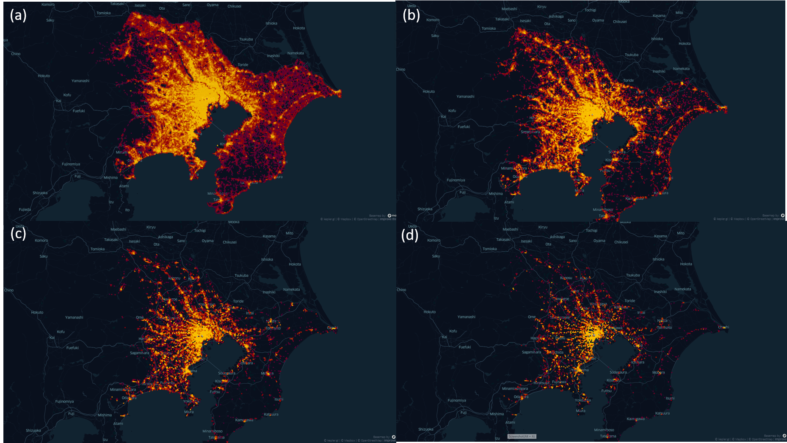
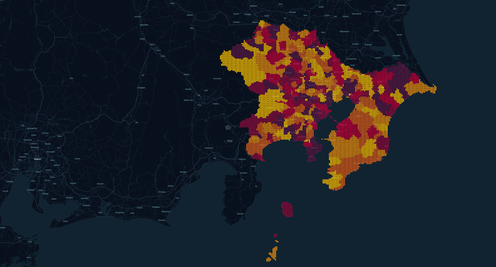

# Spatial_data_preprocessing
- Given the administrative district boundaries, convert them into a collection of meshes and count the number of POIs in each mesh. 
This is a quite important data preprocessing process for practitioners in spatial information science. 
- 给定行政区边界，将其转化为mesh 的集合，并统计每个mesh 中poi 的数目，对于spatial information science 的从业者来说，这是一个相当重要的数据预处理流程。
- 与えられた行政区の境界をメッシュの集合に変換し、各メッシュ内のPOIの数を集計することは、空間情報科学の専門家にとって非常に重要なデータ前処理プロセスです。

# Case of Greater Tokyo Area (Tokyo, Chiba, Saitama, Kanagawa)
### Mesh Level POI Distribution Visualization
- (a)Total POI count distribution
- (b)Restaurant_count distribution
- (c)Shopping mall count distribution
- (d)Entertainment_count distribution

### Border2Mesh Visualization 

